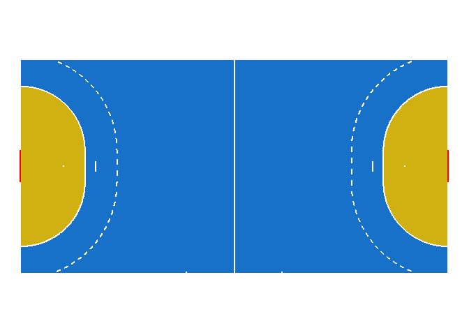
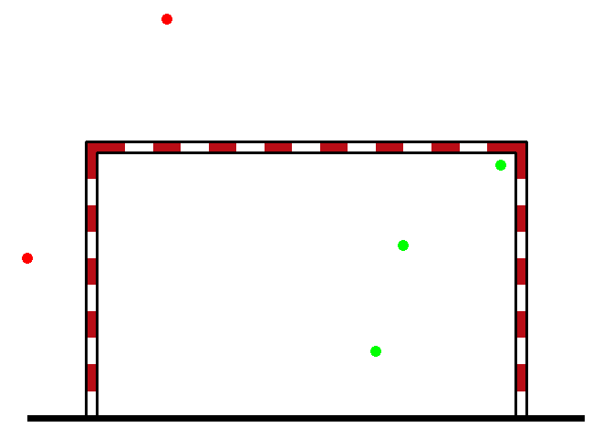
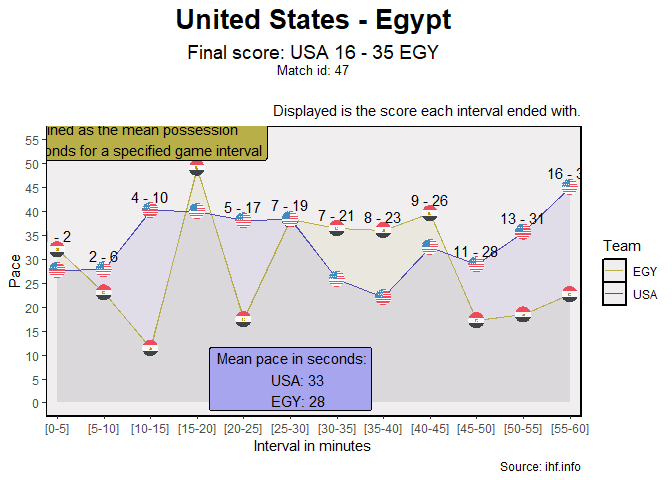

<!-- README.md is generated from README.Rmd. Please edit that file -->

# handbaloner

<!-- badges: start -->
<!-- badges: end -->

El paquete `handbaloner` contiene funciones útiles para la visualización
de datos de balonamno.

## Instalación del paquete

La versión de desarrollo se puede instalar desde
[GitHub](https://github.com/) con:

``` r
# install.packages("devtools")
devtools::install_github("telaroz/handbaloner")

Además, la función `plot_paces` tiene como dependencia el paquete `ggflags` que
no se encuentra en CRAN. Para utilizar estar función, esa dependencia debe
estar instalada (no es necesaria para el resto de funciones del paquete)

``` r
install.packages("ggflags", repos = c(
  "https://jimjam-slam.r-universe.dev",
  "https://cloud.r-project.org"))
```
```

## Ejemplos de visualización de campo

En este ejemplo, podemos ver cómo dibujamos un campo básico.

``` r
library(handbaloner)

court()
```



Podemos cambiar los colores, rotar verticalmente y en espejo con sus
parámetros.

``` r
court(vertical = TRUE, flip = TRUE, court_color = "orange", 
      area_color = "#3431A2", lines_color = "black")
```


Ya que los gráficos están hechos en ggplot, la manera de describir los
colores puede ser en código HEX, rgb, número o por su nombre en inglés;
ver [uso de colores en
ggplot2](https://r-graph-gallery.com/ggplot2-color.html)

Podemos igualmente dibujar la mitad de un campo.

``` r
half_court(vertical = TRUE, court_color = colors()[36], 
      area_color = rgb(red = 0.2, green = 0.4, blue = 0.6), 
      lines_color = "yellow")
```


Otra función útil es `distance_to_goal` que mide la distancia de un
punto del campo al marco más cercano, según sus coordenadas (\[-40, 40\]
en el eje x y \[-20, 20\] en el eje y):

``` r
distance_to_goal(c(10, 3))
#> [1] 10.11187
```

Además, ya que este gráfico es un ggplot, podemos seguir agregando más
capas encima. Por ejemplo, generemos un `data.frame` con coordenadas de
ciertos tiros y si hubo gol o no. A este `data.frame` le agregaremos
además la distancia a gol y graficaremos con puntos en color rojo y
verde si fueron gol o no.

``` r
tiros <- dplyr::tibble(x = c(-13, -12, 11, -11, 9.5),
                       y = c(2, 5, -3, -1, 0),
                       gol = c(1, 0, 1, 1, 0))

dplyr::mutate(tiros, distancia_a_gol = purrr::map2_dbl(x, y, ~ distance_to_goal(c(.x, .y))))
#> # A tibble: 5 x 4
#>       x     y   gol distancia_a_gol
#>   <dbl> <dbl> <dbl>           <dbl>
#> 1 -13       2     1            7.02
#> 2 -12       5     0            8.73
#> 3  11      -3     1            9.12
#> 4 -11      -1     1            9   
#> 5   9.5     0     0           10.5
```

``` r
court() +
  ggplot2::geom_point(data = tiros, ggplot2::aes(x, y),
                      color = ifelse(tiros$gol == 1, 'Green', 'Red'),
                      size = 4)
```


## Ejemplos de visualización del marco

Con este ejemplo, dibujamos un marco de balonmano en sus dimensiones oficiales.

``` r
library(handbaloner)

draw_goal()
```


Cambiamos el color del marco. Por defecto es rojo

``` r
library(handbaloner)

draw_goal("blue")
```


Ahora, dibujemos algunos tiros, como hicimos con el campo completo

``` r
tiros_a_gol <- dplyr::tibble(x = c(-2, -1, 0.5, 0.7, 1.4),
                       y = c(0.2, 2, -0.5, 0.3, 0.9),
                       gol = c(0, 0, 1, 1, 1))

draw_goal() +
  ggplot2::geom_point(data = tiros_a_gol, ggplot2::aes(x, y),
                      color = ifelse(tiros_a_gol$gol == 1, 'Green', 'Red'),
                      size = 4)
```




## Generar Play by Play en formato tidy desde datos de IHF

Primero, se necesita descargar el archivo PDF con el PBP. Para esta tarea, se 
puede utilizar la función `scrape_from_ihf`. Se necesita el enlace de la 
información del partido y la carpeta a la cuál descargar el archivo.

Para el primer partido del mundial masculino del 2023, se puede descargar los 
PDFs de la siguiente forma:

``` r
scrape_from_ihf(link = "https://www.ihf.info/competitions/men/308/28th-ihf-men039s-world-championship-2023-polandsweden/101253/match-center/118963",
                folder = "ejemplo")
```

Ahora, con ayuda de `generate_tidy_pbp` se genera un `data.frame\` en formato 
tidy.

``` r
tidy <- generate_tidy_pbp("ejemplo/47PBP.PDF")
#> Column 2 ['V3'] of item 2 is missing in item 1. Use fill=TRUE to fill with NA (NULL for list columns), or use.names=FALSE to ignore column names. use.names='check' (default from v1.12.2) emits this message and proceeds as if use.names=FALSE for  backwards compatibility. See news item 5 in v1.12.2 for options to control this message.
```

``` r
tidy
```

## Graficar ritmo de juego de ambos equipos a través del juego

Para graficar el ritmo de ambos equipos en intervalos de 5 minutos, solamente
necesitamos los datos del play by play generados en formato tidy por la 
función `generate_tidy_pbp`. La función `plot_paces` toma los datos el número
identificador del partido que queremos visualizar y devuelve el gráfico.


``` r
plot_paces(tidy, 47)
```


