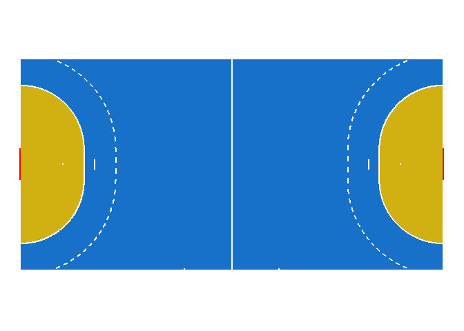
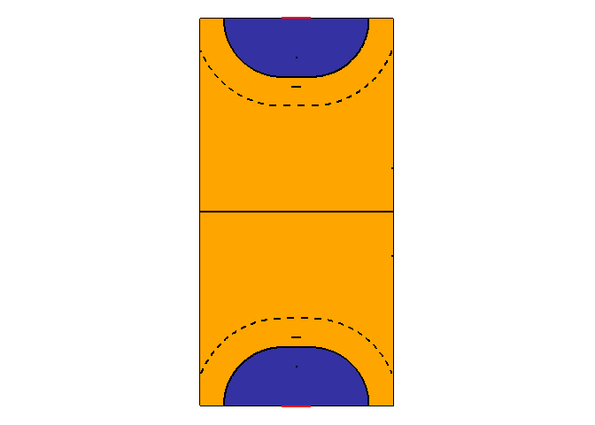
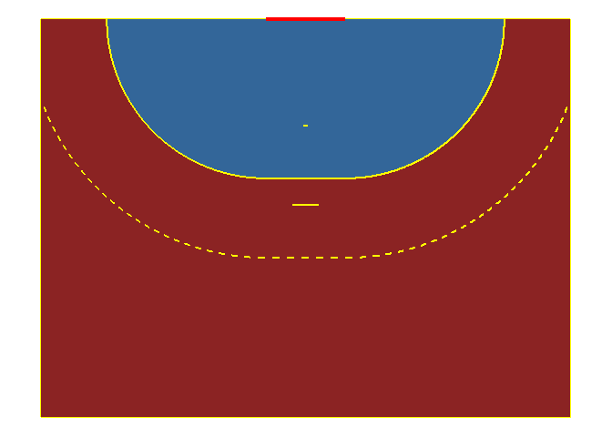
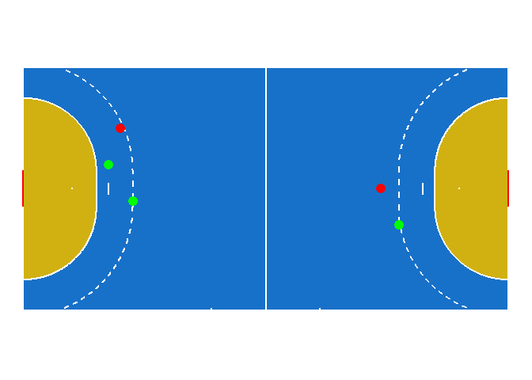
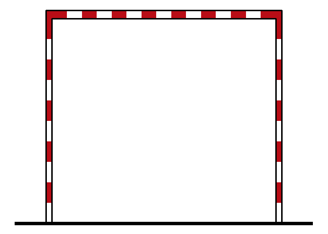
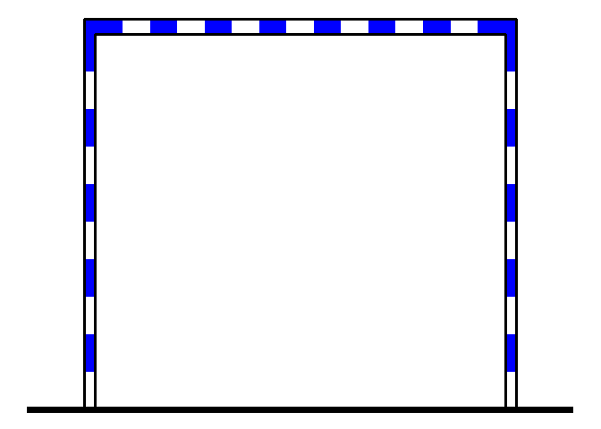
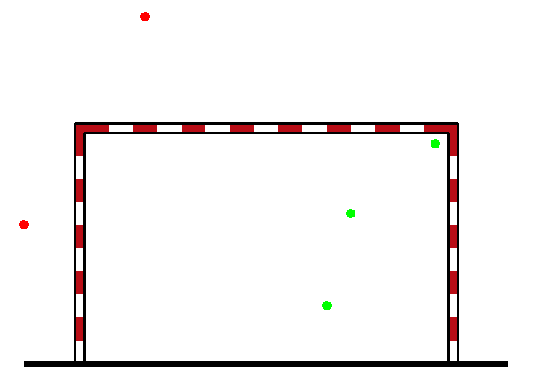
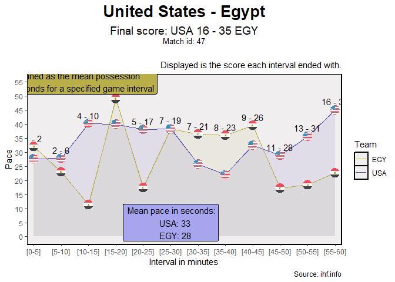

<!-- README.md is generated from README.Rmd. Please edit that file -->

# handbaloner

- Documentación en [español](README.es.md) <!-- badges: start -->
  <!-- badges: end -->

The `handbaloner` package has useful function for the visualization of
handball data.

## Package installation

The development version can be installed from
[GitHub](https://github.com/) with:

``` r
# install.packages("devtools")
devtools::install_github("telaroz/handbaloner")
```

Also, the `plot_paces` function has as dependency the package `ggflags`,
which is not in CRAN. So in order to use that function, that dependency
should be installed (not needed to use the rest of the functions)

``` r
install.packages("ggflags", repos = c(
  "https://jimjam-slam.r-universe.dev",
  "https://cloud.r-project.org"))
```

## Court visualization examples

In this example, we can draw a basic court.

``` r
library(handbaloner)

court()
```



We can change the colours, rotate vertically and mirror the court with
the functions’ parameters

``` r
court(vertical = TRUE, flip = TRUE, court_color = "orange", 
      area_color = "#3431A2", lines_color = "black")
```



As the plots are generated with ggplot, we can describe the colours with
their HEX code, rgb, number or by its name in english; see: [use of
colours in ggplot2](https://r-graph-gallery.com/ggplot2-color.html)

We can also draw half a court

``` r
half_court(vertical = TRUE, court_color = colors()[36], 
      area_color = rgb(red = 0.2, green = 0.4, blue = 0.6), 
      lines_color = "yellow")
```



Another useful function is `distance_to_goal` which measures the
distance from a point of the field to its closest goal, given some
coordinates (\[-40, 40\] in the x axis and \[-20, 20\] in the y axis):

``` r
distance_to_goal(x = 10, y = 3)
#> [1] 10.11187
```

Also, as this is a ggplot, we can add some additional layers. For
example, let’s generate a `data.frame` with some coordinates of shots
and whether they were goals or not. We will add the distance to goal as
a column and plot in green and red if the shots were goal or not.

``` r
shots <- dplyr::tibble(x = c(-13, -12, 11, -11, 9.5),
                       y = c(2, 5, -3, -1, 0),
                       gol = c(1, 0, 1, 1, 0))

dplyr::mutate(shots, distance_to_goal = distance_to_goal(x, y))
#> # A tibble: 5 × 4
#>       x     y   gol distance_to_goal
#>   <dbl> <dbl> <dbl>            <dbl>
#> 1 -13       2     1             50.4
#> 2 -12       5     0             50.4
#> 3  11      -3     1             50.4
#> 4 -11      -1     1             50.4
#> 5   9.5     0     0             50.4
```

``` r
court() +
  ggplot2::geom_point(data = shots, ggplot2::aes(x, y),
                      color = ifelse(shots$gol == 1, 'Green', 'Red'),
                      size = 4)
```



## Goal visualization examples

In this example, we can draw a handball goal.

``` r
library(handbaloner)

draw_goal()
```



We can change the colour of the goal. It is red by default.

``` r
library(handbaloner)

draw_goal("blue")
```



Now, let’s draw some shots, just as we did with the court:

``` r
goal_shots <- dplyr::tibble(x = c(-2, -1, 0.5, 0.7, 1.4),
                       y = c(0.2, 2, -0.5, 0.3, 0.9),
                       gol = c(0, 0, 1, 1, 1))

draw_goal() +
  ggplot2::geom_point(data = goal_shots, ggplot2::aes(x, y),
                      color = ifelse(goal_shots$gol == 1, 'Green', 'Red'),
                      size = 4)
```



## Generate Play by Play tidy data from IHF files

First, you need to download the PBP pdf file. You can use the
`scrape_from_ihf` function to do so. Find the link for the match
information and set the folder to download the file.

For the first match of the 2023 World Men’s Handball Championship, you
can download all PDFs as follows:

``` r

scrape_from_ihf(link = "https://www.ihf.info/competitions/men/308/28th-ihf-men039s-world-championship-2023-polandsweden/101253/match-center/118963",
                folder = "ejemplo")
```

Now, use the `generate_tidy_pbp` to generate a `data.frame` in a tidy
format.

``` r
tidy <- generate_tidy_pbp("ejemplo/47PBP.PDF")
#> Column 2 ['V3'] of item 2 is missing in item 1. Use fill=TRUE to fill with NA (NULL for list columns), or use.names=FALSE to ignore column names. use.names='check' (default from v1.12.2) emits this message and proceeds as if use.names=FALSE for  backwards compatibility. See news item 5 in v1.12.2 for options to control this message.
```

``` r
tidy
#>      match_id     teams gender   time numeric_time  half
#>         <num>    <char> <char> <char>        <num> <num>
#>   1:       47 USA - EGY      M   0:00            0     1
#>   2:       47 USA - EGY      M   0:00            0     1
#>   3:       47 USA - EGY      M   0:39           39     1
#>   4:       47 USA - EGY      M   0:39           39     1
#>   5:       47 USA - EGY      M   0:47           47     1
#>  ---                                                    
#> 169:       47 USA - EGY      M  57:33         3453     2
#> 170:       47 USA - EGY      M  58:28         3508     2
#> 171:       47 USA - EGY      M  59:11         3551     2
#> 172:       47 USA - EGY      M  59:45         3585     2
#> 173:       47 USA - EGY      M  59:55         3595     2
#>                                                                action number
#>                                                                <char> <char>
#>   1:                                            ROBINSON N Goalkeeper    99 
#>   2:                                             HENDAWY K Goalkeeper    88 
#>   3:                                             STROMBERG J Turnover     6 
#>   4:                                                  HENDAWY K Steal    88 
#>   5:         SAAD A Goal right wing top left (48 ABDELHAK M), 86 km/h    53 
#>  ---                                                                        
#> 169:                            ELDERAA Y Goal centre 9m bottom right    39 
#> 170: AMITOVIC A Goal centre 9m bottom left (7 CHAN BLANCO A), 79 km/h     5 
#> 171:                             ELDERAA S Goal centre 9m bottom left    45 
#> 172:                                   AMITOVIC A Shot centre 9m post     5 
#> 173:                                    SHEBIB M Technical Fault (FB)    89 
#>        team goalkeeper opponent_goalkeeper assist_number goal_number
#>      <char>     <char>              <char>        <char>      <char>
#>   1:    USA        99                  88           <NA>        <NA>
#>   2:    EGY        88                  99           <NA>        <NA>
#>   3:    USA        99                  88           <NA>        <NA>
#>   4:    EGY        88                  99           <NA>        <NA>
#>   5:    EGY        88                  99             48         53 
#>  ---                                                                
#> 169:    EGY        92                  99           <NA>         39 
#> 170:    USA        99                  92              7          5 
#> 171:    EGY        92                  99           <NA>         45 
#> 172:    USA        99                  92           <NA>        <NA>
#> 173:    EGY        92                  99           <NA>        <NA>
#>      shot_number  goal shot_speed in_goal_position shot_position  post saved
#>           <char> <num>      <num>           <char>        <char> <num> <num>
#>   1:        <NA>     0         NA             <NA>          <NA>    NA    NA
#>   2:        <NA>     0         NA             <NA>          <NA>    NA    NA
#>   3:        <NA>     0         NA             <NA>          <NA>    NA    NA
#>   4:        <NA>     0         NA             <NA>          <NA>    NA    NA
#>   5:        <NA>     1         86         top left    right wing    NA    NA
#>  ---                                                                        
#> 169:        <NA>     1         NA     bottom right     centre 9m    NA    NA
#> 170:        <NA>     1         79      bottom left     centre 9m    NA    NA
#> 171:        <NA>     1         NA      bottom left     centre 9m    NA    NA
#> 172:          5      0         NA             post     centre 9m     1    NA
#> 173:        <NA>     0         NA             <NA>          <NA>    NA    NA
#>      vertical_goal_position horizontal_goal_position causes_7m_number
#>                      <char>                   <char>           <char>
#>   1:                   <NA>                     <NA>             <NA>
#>   2:                   <NA>                     <NA>             <NA>
#>   3:                   <NA>                     <NA>             <NA>
#>   4:                   <NA>                     <NA>             <NA>
#>   5:                    top                     left             <NA>
#>  ---                                                                 
#> 169:                 bottom                    right             <NA>
#> 170:                 bottom                     left             <NA>
#> 171:                 bottom                     left             <NA>
#> 172:                   <NA>                     <NA>             <NA>
#> 173:                   <NA>                     <NA>             <NA>
#>      receives_7m_number turnover technical_foul  steal suspension is_home
#>                  <char>   <char>         <char> <char>     <char>  <lgcl>
#>   1:               <NA>     <NA>           <NA>   <NA>       <NA>    TRUE
#>   2:               <NA>     <NA>           <NA>   <NA>       <NA>   FALSE
#>   3:               <NA>       6            <NA>   <NA>       <NA>    TRUE
#>   4:               <NA>     <NA>           <NA>    88        <NA>   FALSE
#>   5:               <NA>     <NA>           <NA>   <NA>       <NA>   FALSE
#>  ---                                                                     
#> 169:               <NA>     <NA>           <NA>   <NA>       <NA>   FALSE
#> 170:               <NA>     <NA>           <NA>   <NA>       <NA>    TRUE
#> 171:               <NA>     <NA>           <NA>   <NA>       <NA>   FALSE
#> 172:               <NA>     <NA>           <NA>   <NA>       <NA>    TRUE
#> 173:               <NA>     <NA>            89    <NA>       <NA>   FALSE
#>      number_suspended no_goalkeeper number_court_players possession
#>                 <int>         <num>                <num>     <char>
#>   1:                0            NA                   NA        USA
#>   2:                0            NA                   NA        USA
#>   3:                0             0                    6        USA
#>   4:                0             0                    6        USA
#>   5:                0             0                    6        EGY
#>  ---                                                               
#> 169:                0             0                    6        EGY
#> 170:                0             0                    6        USA
#> 171:                0             0                    6        EGY
#> 172:                0             0                    6        USA
#> 173:                0             0                    6        EGY
#>      number_of_possession start_of_possession end_of_possession   score  lead
#>                     <int>              <char>            <char>  <char> <num>
#>   1:                    1                <NA>              <NA>   0 - 0     0
#>   2:                    1                <NA>              <NA>   0 - 0     0
#>   3:                    1                0:00              0:39   0 - 0     0
#>   4:                    1                0:00              0:39   0 - 0     0
#>   5:                    2                0:39              0:47   0 - 1    -1
#>  ---                                                                         
#> 169:                  115               57:22             57:33 15 - 34   -19
#> 170:                  116               57:33             58:28 16 - 34   -18
#> 171:                  117               58:28             59:11 16 - 35   -19
#> 172:                  118               59:11             59:45 16 - 35   -19
#> 173:                  119               59:45             60:00 16 - 35   -19
#>      possession_length
#>                  <num>
#>   1:                NA
#>   2:                NA
#>   3:                39
#>   4:                39
#>   5:                 8
#>  ---                  
#> 169:                11
#> 170:                55
#> 171:                43
#> 172:                34
#> 173:                15
```

## Plot paces of both teams throughout the game

To plot the paces of both teams in 5 minute intervals, we just need to
have the play by play data in a tidy format generated by the
`generate_tidy_pbp`. The `plot_paces` function takes the data and the
match ID we want to visualize and returns the plot.

``` r
plot_paces(tidy, 47)
```


